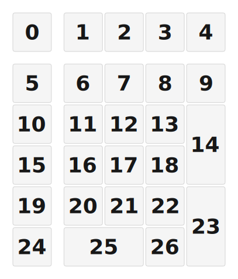

# ZMK Configuration for Number_pad

*Generated by Shield Wizard for ZMK*



Download compiled firmware from the Actions tab. <https://zmk.dev/docs/user-setup#installing-the-firmware>

Edit your keymap <https://zmk.dev/docs/keymaps>.
User keymap is located at [`config/number_pad.keymap`](config/number_pad.keymap).

-----

<details>
<summary>
Shield Wizard Debug Information
</summary>

In case of broken configuration, here is the Shield Wizard internal data used to generate this configuration:

Commit: 5840d41ac0915092c8fe45da617ffb4bb91e1b97

```json
{"name":"Number_pad","shield":"number_pad","dongle":false,"modules":[],"layout":[{"id":"01KQ3W8P36BEPEBJP6SZFF0R5K","part":0,"row":0,"col":1,"w":1,"h":1,"x":0,"y":0,"r":0,"rx":0,"ry":0},{"id":"01KQ3W8P8KQ9FPJSPF6GDWJDPT","part":0,"row":0,"col":2,"w":1,"h":1,"x":1.25,"y":0,"r":0,"rx":0,"ry":0},{"id":"01KQ3W8PE7JP0V9831VZ8AHD6N","part":0,"row":0,"col":3,"w":1,"h":1,"x":2.25,"y":0,"r":0,"rx":0,"ry":0},{"id":"01KQ3W8PMQB5Z8FJ8NGAAWHY66","part":0,"row":0,"col":4,"w":1,"h":1,"x":3.25,"y":0,"r":0,"rx":0,"ry":0},{"id":"01KQ3W8PTB31GKCFVKQFQ43D0M","part":0,"row":0,"col":5,"w":1,"h":1,"x":4.25,"y":0,"r":0,"rx":0,"ry":0},{"id":"01KQ3SZ0E5QCME2W79G418ZQ43","part":0,"row":1,"col":1,"w":1,"h":1,"x":0,"y":1.25,"r":0,"rx":0,"ry":0},{"id":"01KQ3W8J1XEJ3QQGGSSSEFB8GE","part":0,"row":1,"col":2,"w":1,"h":1,"x":1.25,"y":1.25,"r":0,"rx":0,"ry":0},{"id":"01KQ3W8JKQVEC79P1QTTSFD7N5","part":0,"row":1,"col":3,"w":1,"h":1,"x":2.25,"y":1.25,"r":0,"rx":0,"ry":0},{"id":"01KQ3W8JSW8V40KB658SXZ42WB","part":0,"row":1,"col":4,"w":1,"h":1,"x":3.25,"y":1.25,"r":0,"rx":0,"ry":0},{"id":"01KQ3W8MPKNC2Q0SGXV3YD8FDS","part":0,"row":1,"col":5,"w":1,"h":1,"x":4.25,"y":1.25,"r":0,"rx":0,"ry":0},{"id":"01KQ3W8MXA2Z9HJ7S9FJJDKJ0J","part":0,"row":2,"col":1,"w":1,"h":1,"x":0,"y":2.25,"r":0,"rx":0,"ry":0},{"id":"01KQ3W8N8GEAEJDC75Y8GZN92A","part":0,"row":2,"col":2,"w":1,"h":1,"x":1.25,"y":2.25,"r":0,"rx":0,"ry":0},{"id":"01KQ3W8NDM9C4C8AVAWASE55MM","part":0,"row":2,"col":3,"w":1,"h":1,"x":2.25,"y":2.25,"r":0,"rx":0,"ry":0},{"id":"01KQ3W8NPMNKKARK8NCCPB8RT6","part":0,"row":2,"col":4,"w":1,"h":1,"x":3.25,"y":2.25,"r":0,"rx":0,"ry":0},{"id":"01KQ3W8NXHQC10EVCX0EYH5KG1","part":0,"row":2,"col":5,"w":1,"h":2,"x":4.25,"y":2.25,"r":0,"rx":0,"ry":0},{"id":"01KQ3W8N339CJN0WEXH8SK3D7M","part":0,"row":3,"col":1,"w":1,"h":1,"x":0,"y":3.25,"r":0,"rx":0,"ry":0},{"id":"01KQ3W8R6SW1S6HZ65NMZP3H4Y","part":0,"row":3,"col":2,"w":1,"h":1,"x":1.25,"y":3.25,"r":0,"rx":0,"ry":0},{"id":"01KQ3W8RC0FTT41GCZ1GMP1MEV","part":0,"row":3,"col":3,"w":1,"h":1,"x":2.25,"y":3.25,"r":0,"rx":0,"ry":0},{"id":"01KQ3W8RKJRZY44Q7TBS0M3Q2S","part":0,"row":3,"col":4,"w":1,"h":1,"x":3.25,"y":3.25,"r":0,"rx":0,"ry":0},{"id":"01KQ3W8Q0A9JQWDFZ515Y4N8T1","part":0,"row":4,"col":1,"w":1,"h":1,"x":0,"y":4.25,"r":0,"rx":0,"ry":0},{"id":"01KQ3W8Q6RW41XPQ2BX7G8JWSM","part":0,"row":4,"col":2,"w":1,"h":1,"x":1.25,"y":4.25,"r":0,"rx":0,"ry":0},{"id":"01KQ3W8QBSX3C1Q0T0SY22XMJX","part":0,"row":4,"col":3,"w":1,"h":1,"x":2.25,"y":4.25,"r":0,"rx":0,"ry":0},{"id":"01KQ3W8QHWPJQKFZ7RC4XCBNG9","part":0,"row":4,"col":4,"w":1,"h":1,"x":3.25,"y":4.25,"r":0,"rx":0,"ry":0},{"id":"01KQ3W8SGBA6YWCS6PQ8DXXZ1V","part":0,"row":4,"col":5,"w":1,"h":2,"x":4.25,"y":4.25,"r":0,"rx":0,"ry":0},{"id":"01KQ3WM626ZD4Q97SB0BSMRC5K","part":0,"row":5,"col":1,"w":1,"h":1,"x":0,"y":5.25,"r":0,"rx":0,"ry":0},{"id":"01KQ3WM707QGY08FWDKT8XYEEG","part":0,"row":5,"col":2,"w":2,"h":1,"x":1.25,"y":5.25,"r":0,"rx":0,"ry":0},{"id":"01KQ3WM6HMY7BYPPQ87C132MVK","part":0,"row":5,"col":3,"w":1,"h":1,"x":3.25,"y":5.25,"r":0,"rx":0,"ry":0}],"parts":[{"name":"unibody","controller":"nice_nano_v2","wiring":"matrix_diode","pins":{"d2":"input","d3":"input","d4":"input","d5":"input","d6":"input","d7":"input","d21":"output","d20":"output","d19":"output","d18":"output","d15":"output","d1":"encoder","d0":"encoder"},"keys":{"01KQ3W8P36BEPEBJP6SZFF0R5K":{"input":"d2","output":"d21"},"01KQ3W8P8KQ9FPJSPF6GDWJDPT":{"input":"d2","output":"d20"},"01KQ3W8PE7JP0V9831VZ8AHD6N":{"input":"d2","output":"d19"},"01KQ3W8PMQB5Z8FJ8NGAAWHY66":{"input":"d2","output":"d18"},"01KQ3W8PTB31GKCFVKQFQ43D0M":{"input":"d2","output":"d15"},"01KQ3SZ0E5QCME2W79G418ZQ43":{"input":"d3","output":"d21"},"01KQ3W8J1XEJ3QQGGSSSEFB8GE":{"input":"d3","output":"d20"},"01KQ3W8JKQVEC79P1QTTSFD7N5":{"input":"d3","output":"d19"},"01KQ3W8JSW8V40KB658SXZ42WB":{"input":"d3","output":"d18"},"01KQ3W8MPKNC2Q0SGXV3YD8FDS":{"input":"d3","output":"d15"},"01KQ3W8MXA2Z9HJ7S9FJJDKJ0J":{"input":"d4","output":"d21"},"01KQ3W8N8GEAEJDC75Y8GZN92A":{"input":"d4","output":"d20"},"01KQ3W8NDM9C4C8AVAWASE55MM":{"input":"d4","output":"d19"},"01KQ3W8NPMNKKARK8NCCPB8RT6":{"input":"d4","output":"d18"},"01KQ3W8NXHQC10EVCX0EYH5KG1":{"input":"d4","output":"d15"},"01KQ3W8N339CJN0WEXH8SK3D7M":{"input":"d5","output":"d21"},"01KQ3W8R6SW1S6HZ65NMZP3H4Y":{"input":"d5","output":"d20"},"01KQ3W8RC0FTT41GCZ1GMP1MEV":{"input":"d5","output":"d19"},"01KQ3W8RKJRZY44Q7TBS0M3Q2S":{"input":"d5","output":"d18"},"01KQ3W8Q0A9JQWDFZ515Y4N8T1":{"input":"d6","output":"d21"},"01KQ3W8Q6RW41XPQ2BX7G8JWSM":{"input":"d6","output":"d20"},"01KQ3W8QBSX3C1Q0T0SY22XMJX":{"input":"d6","output":"d19"},"01KQ3W8QHWPJQKFZ7RC4XCBNG9":{"input":"d6","output":"d18"},"01KQ3W8SGBA6YWCS6PQ8DXXZ1V":{"input":"d6","output":"d15"},"01KQ3WM626ZD4Q97SB0BSMRC5K":{"input":"d7","output":"d21"},"01KQ3WM707QGY08FWDKT8XYEEG":{"input":"d7","output":"d20"},"01KQ3WM6HMY7BYPPQ87C132MVK":{"input":"d7","output":"d18"}},"encoders":[{"pinA":"d1","pinB":"d0"}],"buses":[{"name":"spi0","devices":[],"type":"spi"},{"name":"spi1","devices":[],"type":"spi"},{"name":"spi2","devices":[],"type":"spi"},{"name":"spi3","devices":[],"type":"spi"},{"name":"i2c0","devices":[],"type":"i2c"},{"name":"i2c1","devices":[],"type":"i2c"}]}]}
```

</details>
